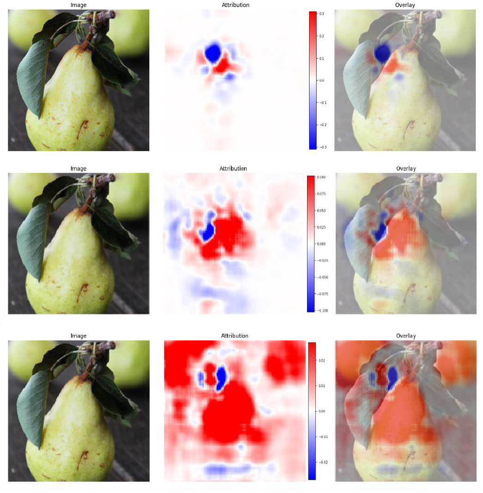

# Mean-Cov Neural Encoding on Ventral-stream Spiking Dataset

This project studies neural encoding in the [THINGS Ventral-stream Spiking Dataset (TVSD)](https://gin.g-node.org/paolo_papale/TVSD), a large-scale macaque electrophysiology resource built on the [THINGS image database](https://things-initiative.org). THINGS contains 1,854 systematically sampled object concepts and 26,107 naturalistic images, and TVSD provides 1,024 electrodes across V1, V4, and IT in two macaques viewing about 22k THINGS images in the ventral-stream experiment. The present work focuses on image-conditioned prediction of visual responses and on interpretable analysis of the learned encoding model.

---

## Model

The proposed framework is a **mean-covariance neural encoding model** in which, for an image $x$, the neural response vector $r$ is described by an image-dependent mean and an image-dependent covariance:

$$r \mid x \sim \mathcal{N}(\mu_\theta(x),\; \Sigma_\phi(x))$$

The mean term captures stimulus-driven firing-rate structure, whereas the covariance term captures structured trial-to-trial cofluctuation beyond the mean. This decomposition matters because an image may shape not only the expected amplitude of responses but also the pattern of shared variability across electrodes and regions.

The image encoder transforms each image into a feature representation, and the mean model maps those features to predicted neural activity for individual electrodes:

$$\hat{\mu}(x) = W f_\psi(x) + b$$

Here $f_\psi(x)$ denotes the image encoder and $W$ projects encoder features into neural-response space.

---

## Interpretability

Model interpretability was assessed with **occlusion analysis**: local image patches are masked one at a time and the resulting change in predicted neural response is measured.

<p align="center">
  
</p>

**Figure 1.** Three ventral-stream examples for a single pear image, ordered top to bottom.
- **Top — V1**, electrode 405, time bin 15: attribution is spatially diffuse, consistent with low-level feature selectivity.
- **Middle — V4**, electrode 987, time bin 19: attribution shifts toward mid-level shape and surface regions.
- **Bottom — IT**, electrode 548, time bin 23: attribution is concentrated on the pear body, consistent with high-level object selectivity.

**Red** regions indicate patches whose occlusion *reduces* the predicted response (supportive evidence); **blue** regions indicate patches whose occlusion *increases* the predicted response (suppressive or competing evidence). Attribution maps reflect model behavior and should not be interpreted as direct evidence of biological causality.

---

## Research Questions

1. Does the complexity of image features that best predict neural responses increase systematically from V1 → V4 → IT?
2. Does an image-conditioned covariance model predict held-out trial-to-trial variability better than an image-independent covariance model, after accounting for the mean response?
3. If covariance is image-dependent, is it primarily expressed **within ROIs** or through **forward/backward interactions** between V1, V4, and IT — and what visual properties of the image drive it?

---

## Repository Structure

```
tvsd-encode/
├── main.ipynb                  # End-to-end notebook: data → model → results
└── src/
    ├── classes.py              # Model and dataset class definitions
    ├── helper_functions.py     # Preprocessing, training, and evaluation utilities
    └── plot_functions.py       # Visualization and occlusion attribution plots

```
---

## Data

This project uses two public datasets:

- **TVSD** — Papale P, Wang F, Self MW, Roelfsema PR (2025). *An extensive dataset of spiking activity to reveal the syntax of the ventral stream.* Neuron 113, 539–553. [[Paper]](https://doi.org/10.1016/j.neuron.2024.10.035) [[Data]](https://gin.g-node.org/paolo_papale/TVSD)

- **THINGS** — Hebart MN, Dickter AH, Kidder A, et al. (2019). *THINGS: A database of 1,854 object concepts and more than 26,000 naturalistic object images.* PLoS ONE 14(10): e0223792. [[Paper]](https://doi.org/10.1371/journal.pone.0223792) [[Data]](https://things-initiative.org)

The THINGS stimulus images are not redistributed here; download them separately from [things-initiative.org](https://things-initiative.org).

---

## Citation

If you use this code, please cite the TVSD and THINGS papers above and link to this repository.

